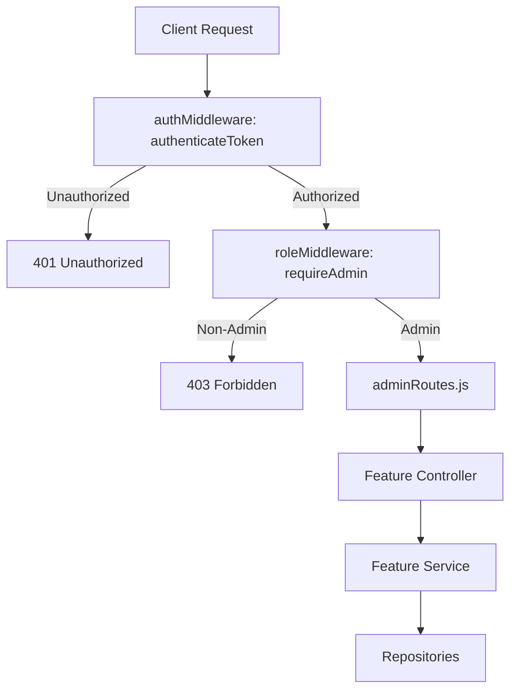

# FitSync Admin Portal Audit & Expansion Plan

This document provides a comprehensive audit of the current FitSync admin panel architecture and details the expansion that was implemented.

---

## 1. Executive Summary

FitSync utilizes a role-based access control (RBAC) mechanism to secure administrative functionality. The administration console is a separate, unified SPA section within the React client, protected by route guards. The backend implements stateless JWT verification followed by role validation.

Nine major administrative modules are fully implemented:

*   **Platform Dashboard / Stats**: System-wide activity indicators, gamification overview, and category usage.
*   **User Management**: View user stats, toggle admin roles, and suspend/activate user access.
*   **Exercise Categories**: Manage default and custom workout categories.
*   **Workout Templates**: Admin-defined workout routines users can pre-fill into a new log entry.
*   **Achievement Badges**: Full CRUD for badge definitions (code, name, description, requirement type/value, icon, sort order, active status).
*   **Community Challenges**: Weekly or themed challenges with start/end dates, metric targets, and reward XP.
*   **System Announcements**: Banner notices targeted by audience and placement, with optional scheduling.
*   **User Feedback**: Triage submitted bug reports, feature requests, and general feedback.
*   **Advanced Analytics**: Aggregate platform metrics, category usage, feedback status counts, and active content counts.

---

## 2. Current Admin Architecture (Audit)

### 2.1 Backend Layer

All admin endpoints are defined under `backend/src/routes/adminRoutes.js` and secured with middleware:
1.  `authenticateToken` (`backend/src/middleware/authMiddleware.js`): Verifies JWT validity and attaches user data (`req.user`) to the request context.
2.  `requireAdmin` (`backend/src/middleware/roleMiddleware.js`): Checks that `req.user.role === 'admin'`. If not, returns `403 Forbidden`.

#### Implemented Endpoints (`backend/src/routes/adminRoutes.js`):

**Platform**
*   `GET /api/admin/stats`: Returns base statistics and gamification statistics.
*   `GET /api/admin/analytics`: Returns aggregate platform metrics, category usage, feedback status counts, and active content counts.

**Users**
*   `GET /api/admin/users`: Query users list with support for search, role, and active/inactive status filters.
*   `GET /api/admin/users/:id`: Details for a specific user, including overall statistics and 5 most recent workouts.
*   `PUT /api/admin/users/:id/role`: Update a user's role (`user` / `admin`). Protects admins from updating their own role.
*   `PUT /api/admin/users/:id/status`: Toggle user status (`is_active` / inactive). Protects admins from deactivating themselves.

**Categories**
*   `GET /api/admin/categories/analytics`: Usage analysis per exercise category.
*   `POST /api/admin/categories`: Create a new custom exercise category.
*   `PUT /api/admin/categories/:id`: Modify a custom category description.
*   `DELETE /api/admin/categories/:id`: Remove a custom category. (System core categories cannot be deleted.)

**Workout Templates**
*   `GET /api/admin/templates`: List all templates.
*   `GET /api/admin/templates/:id`: Detail for a specific template.
*   `POST /api/admin/templates`: Create a new workout template.
*   `PUT /api/admin/templates/:id`: Update a template.
*   `PUT /api/admin/templates/:id/status`: Toggle template active status.
*   `DELETE /api/admin/templates/:id`: Delete a template.

**Achievement Badges**
*   `GET /api/admin/badges`: List all badges.
*   `GET /api/admin/badges/:code`: Detail for a specific badge.
*   `POST /api/admin/badges`: Create a new badge.
*   `PUT /api/admin/badges/:code`: Update a badge.
*   `PATCH /api/admin/badges/:code/status`: Toggle badge active status.

**Community Challenges**
*   `GET /api/admin/challenges`: List all challenges.
*   `GET /api/admin/challenges/:id`: Detail for a specific challenge.
*   `POST /api/admin/challenges`: Create a new challenge.
*   `PUT /api/admin/challenges/:id`: Update a challenge.
*   `PATCH /api/admin/challenges/:id/status`: Toggle challenge active status.

**Announcements**
*   `GET /api/admin/announcements`: List all announcements.
*   `GET /api/admin/announcements/:id`: Detail for a specific announcement.
*   `POST /api/admin/announcements`: Create a new announcement.
*   `PUT /api/admin/announcements/:id`: Update an announcement.
*   `PATCH /api/admin/announcements/:id/status`: Toggle announcement active status.
*   `DELETE /api/admin/announcements/:id`: Delete an announcement.

**User Feedback (Admin Triage)**
*   `GET /api/admin/feedback`: List feedback with optional `status` and `type` filters.
*   `PATCH /api/admin/feedback/:id`: Update feedback status and/or admin note.

#### User-Facing Public/Authenticated Endpoints (non-admin)

*   `GET /api/templates/active`: Public read-only endpoint that returns active workout templates only. It exposes no user-specific private data.
*   `GET /api/challenges/active`: List active community challenges (any authenticated user).
*   `GET /api/announcements/active`: List active announcements filtered by user role (any authenticated user).
*   `POST /api/feedback`: Submit a feedback entry (any authenticated user).

### 2.2 Frontend Layer

*   **Routing (`client/src/App.jsx`)**:
    *   Protected by `<ProtectedRoute>` and `<AdminRoute>` guards.
    *   Maps `/admin/:section` to `AdminDashboard.jsx` → `AdminPortalView.jsx`. The `:section` param drives which tab/view is active.
*   **Route Guards**:
    *   `AdminRoute.jsx`: Checks `user.role === 'admin'`. Non-admins are redirected to `/`.
    *   `ProtectedRoute.jsx`: Requires a valid JWT token. Unauthenticated users are redirected to `/login`.
*   **Layout & Components**:
    *   `AdminLayout.jsx`: Admin navigation and template styling.
    *   `AdminPortalView.jsx`: Consolidates all nine admin sub-sections with lazy data loading per active tab.
*   **Service Wrapper (`client/src/services/adminService.js`)**:
    *   Provides methods for all admin API calls via `apiClient`.

---

## 3. Implemented Features (Complete)

### 3.1 Dashboard & Statistics
*   **Data Source**: `adminService.getStats()` and `adminService.getAnalytics()`.
*   **Metrics**: Total users, workouts logged, weight entries, AI insights generated, weekly active users, average streak, total check-ins.
*   **Analytics Table**: Category usage showing name, type (Core/Custom), times logged, cumulative minutes, calories burned.

### 3.2 User Management
*   **Data Source**: `adminService.getUsers(filters)` and `adminService.getUserDetail(id)`.
*   **Interactions**: Filter by search, role, status; modal user detail view; role promotion/demotion; account activation/deactivation (self-action protected).

### 3.3 Exercise Categories
*   **Data Source**: `adminService.getCategories()` and category analytics endpoint.
*   **Interactions**: Create custom categories; edit descriptions; delete custom categories (core categories protected).

### 3.4 Workout Templates
*   **Data Source**: `adminService.getTemplates()` and detail/CRUD methods.
*   **Interactions**: Create templates with exercise builder (structured or JSON editor); edit; toggle active/inactive; delete.
*   **User Integration**: Active templates appear on the workout log page for pre-fill selection.

### 3.5 Achievement Badges
*   **Data Source**: `adminService.getBadges()` and CRUD methods.
*   **Interactions**: Create badges with code, name, description, requirement type/value, icon, sort order, active status; edit; toggle active/inactive.

### 3.6 Community Challenges
*   **Data Source**: `adminService.getChallenges()` and CRUD methods.
*   **Interactions**: Create challenges with title, description, challenge type, target value, start/end dates, reward XP, optional badge code; edit; toggle active/inactive.
*   **User Integration**: Active challenges appear on the user dashboard.

### 3.7 System Announcements
*   **Data Source**: `adminService.getAnnouncements()` and CRUD methods.
*   **Interactions**: Create announcements with title, body, audience, placement, start/end schedule, active status; edit; toggle active/inactive; delete.
*   **User Integration**: Active announcements appear as a banner on the user dashboard.

### 3.8 User Feedback
*   **Data Source**: `adminService.getFeedbackList(filters)` and `adminService.updateFeedback(id, data)`.
*   **Interactions**: Filter by status and type; update status (`new` / `in_progress` / `resolved` / `archived`) and add admin notes.
*   **User Submission**: `POST /api/feedback` accepts authenticated feedback submissions with type, optional subject, and message. The React client does not currently include a user-facing feedback form.

### 3.9 Advanced Analytics
*   **Data Source**: `adminService.getAnalytics()`.
*   **Metrics**: Current analytics focus on aggregate platform metrics, category usage, feedback counts, and active challenge/announcement counts. They do not currently provide time-series user growth, workout volume trends, or weight-entry trends.

---

## 4. Security & Isolation Check

The system ensures complete logic separation between user operations and admin operations:

1.  **Strict Middleware Placement**: All routes in `adminRoutes.js` pass through `authenticateToken` AND `requireAdmin` via `router.use(authenticateToken, requireAdmin)` applied at the router level. Any additional admin endpoint added to this router automatically inherits both guards.
2.  **No Leaked Actions**: Admins cannot use admin actions to alter their own state (e.g. self-demotion or self-deactivation is rejected at the controller/service layer).
3.  **Core Protection**: Delete operations on default core categories are restricted in the repository layer to prevent platform breakdown.
4.  **Frontend Route Guard**: `AdminRoute.jsx` redirects non-admin users to `/` before any admin UI or API call is made.
5.  **User-Facing Endpoints**: `/api/templates/active` is public read-only and returns only active workout templates, with no user-specific private data. `/api/challenges/active`, `/api/announcements/active`, and `POST /api/feedback` are authenticated-user endpoints. `requireAdmin` is not applied to these non-admin routes, while admin write operations remain isolated under `/api/admin/*`.

---

## 5. Implementation Checklist & Verification

### 5.1 Verification Plan

*   Ensure that the platform starts up successfully with database bootstrap.
*   Verify that admin credentials allow login and render all Admin portal tabs.
*   Verify that non-admin accounts are rejected with HTTP 403 and the client redirects appropriately.
*   Core behavior was regression-checked with backend tests and frontend build. Some user-facing files were intentionally touched for templates, challenges, announcements, or dashboard display, so they should be manually reviewed before commit.

### 5.2 Manual Testing Checklist

**Auth & Access Control**
- [ ] Run `npm run dev` in both `backend/` and `client/` directories. Confirm no startup errors.
- [ ] Log in as a standard user (`user@fitsync.com`).
- [ ] Attempt direct browser navigation to `/admin/dashboard`. Confirm redirect to `/`.
- [ ] Send `GET http://localhost:5000/api/admin/stats` with user JWT. Confirm `403 Forbidden` with `"Admin privileges required."`.
- [ ] Log in as `admin@fitsync.com`.

**Admin Portal Tabs**
- [ ] Navigate to `/admin/dashboard`. Confirm platform stats and gamification summary load without console errors.
- [ ] Navigate to `/admin/users`. Confirm user list, search, and filter controls work.
- [ ] Navigate to `/admin/categories`. Confirm category list and analytics table load.
- [ ] Navigate to `/admin/templates`. Confirm template list loads (empty state if none).
- [ ] Navigate to `/admin/badges`. Confirm badge list loads.
- [ ] Navigate to `/admin/challenges`. Confirm challenge list loads.
- [ ] Navigate to `/admin/announcements`. Confirm announcement list loads.
- [ ] Navigate to `/admin/feedback`. Confirm feedback list loads.
- [ ] Navigate to `/admin/analytics`. Confirm aggregate analytics data loads.

**Admin CRUD — Templates**
- [ ] Create a template with at least one exercise. Confirm it appears in the list.
- [ ] Edit the template title. Confirm the change persists on reload.
- [ ] Toggle template inactive. Confirm the status indicator updates.
- [ ] Delete the template. Confirm removal.
- [ ] Confirm active templates appear via the public read-only `GET /api/templates/active` endpoint.
- [ ] Open the workout log page as a regular user. Confirm active templates appear for pre-fill.

**Admin CRUD — Badges**
- [ ] Create a badge with a unique code. Confirm it appears.
- [ ] Edit badge description. Confirm the change persists.
- [ ] Toggle badge status. Confirm indicator updates.

**Admin CRUD — Challenges**
- [ ] Create a challenge with start/end dates. Confirm it appears.
- [ ] Edit the challenge target value. Confirm the change persists.
- [ ] Toggle challenge status. Confirm indicator updates.
- [ ] Confirm active challenges appear via `GET /api/challenges/active`.
- [ ] As a regular user, confirm the active challenge banner shows on the dashboard.

**Admin CRUD — Announcements**
- [ ] Create an announcement. Confirm it appears.
- [ ] Toggle active status. Confirm indicator updates.
- [ ] Delete the announcement. Confirm removal.
- [ ] Confirm active announcements appear via `GET /api/announcements/active`.
- [ ] As a regular user, confirm the announcement banner shows on the dashboard.

**Feedback**
- [ ] Submit `POST /api/feedback` directly as an authenticated API request with `{ "type": "bug", "message": "Test entry" }`. Confirm `201 Created`.
- [ ] In the admin feedback tab, confirm the entry appears.
- [ ] Update status to `in_progress`. Confirm the change persists.

**User Features (Regression)**
- [ ] Log a new workout. Confirm it appears in the list and dashboard.
- [ ] Log a weight entry. Confirm it appears in the progress chart.
- [ ] Complete a daily wellness check-in. Confirm streak increments.
- [ ] View AI insight on the dashboard.
- [ ] Deactivate a test user and verify they cannot log in. Reactivate and confirm access is restored.
- [ ] Edit a custom category description. Confirm it persists in the database.
